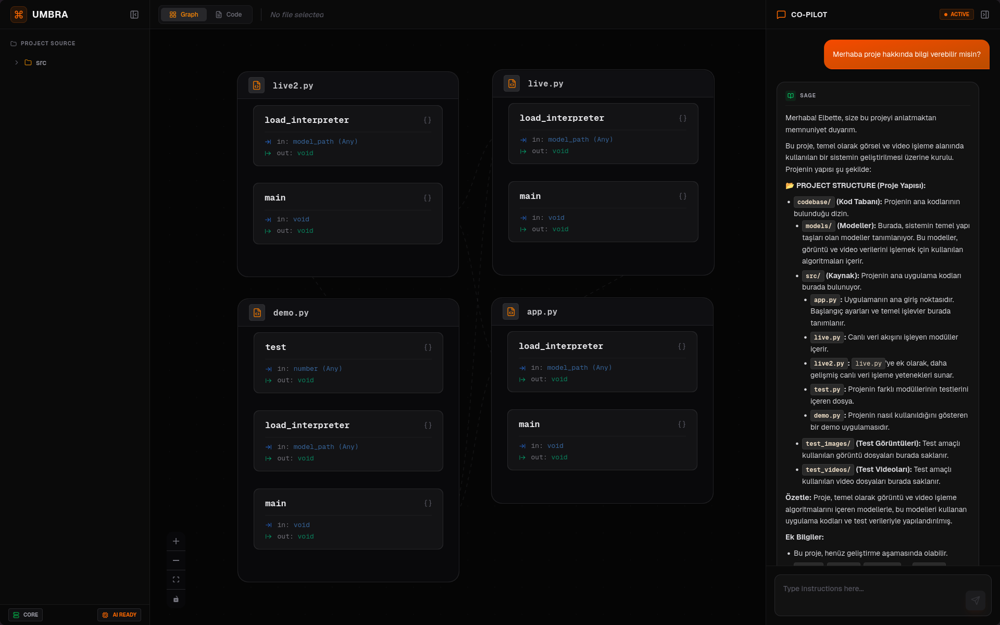
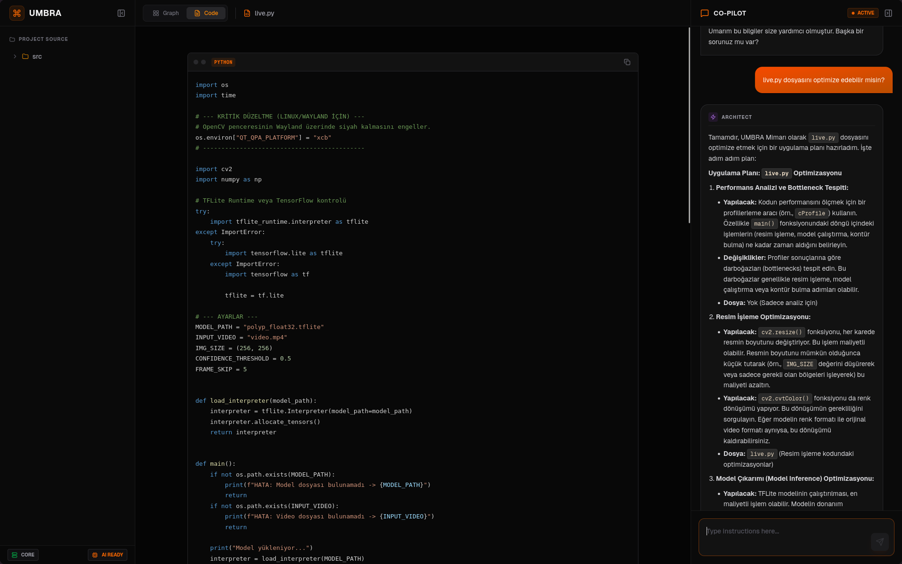
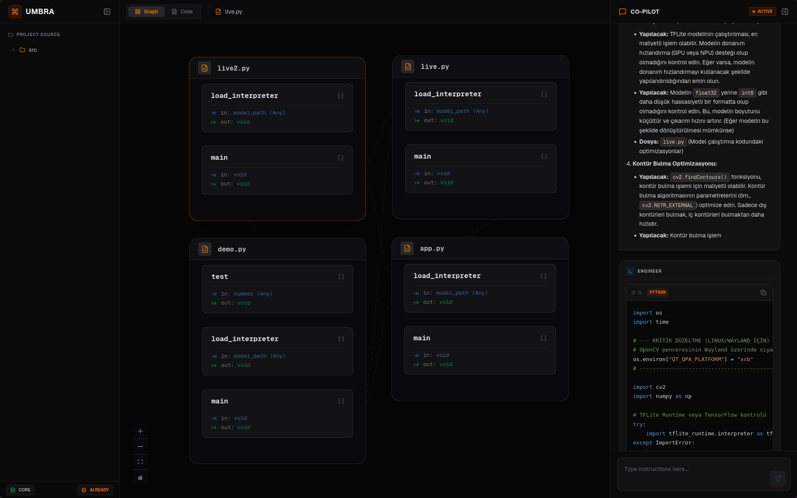

<p align="center">
  
</p>

<h1 align="center">Umbra</h1>

<p align="center">
  <strong>Local Neural Code Architect & Functional Insight Platform</strong>
</p>

<div align="center">
  
  
  
  
  
</div>


---

## Application Overview

<p align="center">
  
  
</p>

<p align="center">
  
  
</p>

---

## Technical Synopsis

Umbra is a high-performance software analysis framework designed to transform static codebases into interactive neural maps. By leveraging local Large Language Models (LLMs) via **llama.cpp**, it bridges the gap between raw source code and architectural understanding. It enables developers to visualize complex function call graphs and interact with autonomous AI agents without ever exposing sensitive data to the cloud.

## Key Capabilities

* **Local Inference Engine**: Powered by **llama.cpp**, ensuring all AI reasoning and code analysis stay on-premise for 100% privacy and zero latency.
* **Neural Graph Mapping**: "Server Rack" style visualization where files act as containers and functions as modules, providing a clear hierarchy of logic flow.
* **Deep AST Parsing**: Implements a surgical **Abstract Syntax Tree (AST)** analysis to extract deep function signatures, internal calls, and logic dependencies.
* **Intelligent Type Inference**: Analyzes internal logic and `return` statements to dynamically infer variable names and data types, such as `result (int)`.
* **Smart Routing Logic**: Advanced edge routing distinguishes between internal file flows (dashed) and external cross-file dependencies (solid) with interactive amber highlighting.

---

## System Architecture

The framework operates through three distinct layers ensuring analytical depth and process isolation:

1. **Neural Engine (Service Layer)**: A Python-based backend managing the **llama.cpp** lifecycle and asynchronous multi-agent (Sage, Architect, Engineer) reasoning.
2. **AST Parser (Analysis Layer)**: A deep-scanning engine that deconstructs source code into logical components and functional relationships.
3. **Core Interface (Visualization Layer)**: A **Next.js** and **React Flow** frontend that renders the hierarchical neural map and provides a VS Code-grade code viewer.

---

## Deployment

### System Requirements
* **Operating System**: Linux, macOS, or Windows (WSL2 recommended).
* **LLM Hardware**: CUDA or Metal-capable GPU recommended for performance.
* **Libraries**: `Python 3.10+`, `Node.js 18+`, `FastAPI`, and `React Flow`.

### Installation
The deployment process handles environment setup and frontend-backend synchronization:

```bash
git clone [https://github.com/seyhankokcu/umbra.git](https://github.com/seyhankokcu/umbra.git)
cd umbra
# Setup backend with llama.cpp models
cd backend && pip install -r requirements.txt
# Setup frontend
cd ../frontend && npm install
npm run dev
```

## Administrative Protocol

The multi-agent system provides specialized protocols for project management:

### Agent Roles

| Agent Role   | Responsibility                               | Scope            |
|-------------|-----------------------------------------------|------------------|
| The Sage     | Structural guidance and documentation         | Knowledge Base   |
| The Architect| Refactoring strategy and system planning      | Strategic Logic  |
| The Engineer | Implementation and local code generation      | Tactical Output  |
| The Auditor  | AST-based integrity and type checking         | Code Validation  |

---


## Logic Configuration

Operational visualization thresholds can be modified in  
`frontend/settings/graph-config.ts` to suit project complexity:

```ts
/* Visualization Parameters */
const RANK_SEP = 300;     // Horizontal distance between file racks
const NODE_SEP = 100;     // Vertical distance between modules
const EDGE_OPACITY = 0.2; // Default visibility for non-active paths
```

## Security Declaration

### Privacy Assurance

Umbra is an **Air-Gapped ready platform**. Since the inference engine is local,  
no telemetry, code snippets, or metadata are transmitted over the network.

### Data Isolation

Analyzed code metadata is stored **in-memory during sessions**, with no persistent  
databases required, ensuring a clean slate upon every reboot.

---

## License

Umbra is open-source software, licensed under the **GNU General Public License v3.0 (GPL-3.0)**. Review the `LICENSE` file for further legal details.
